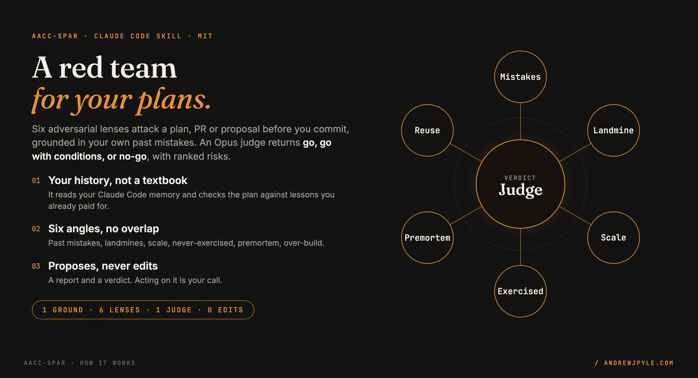
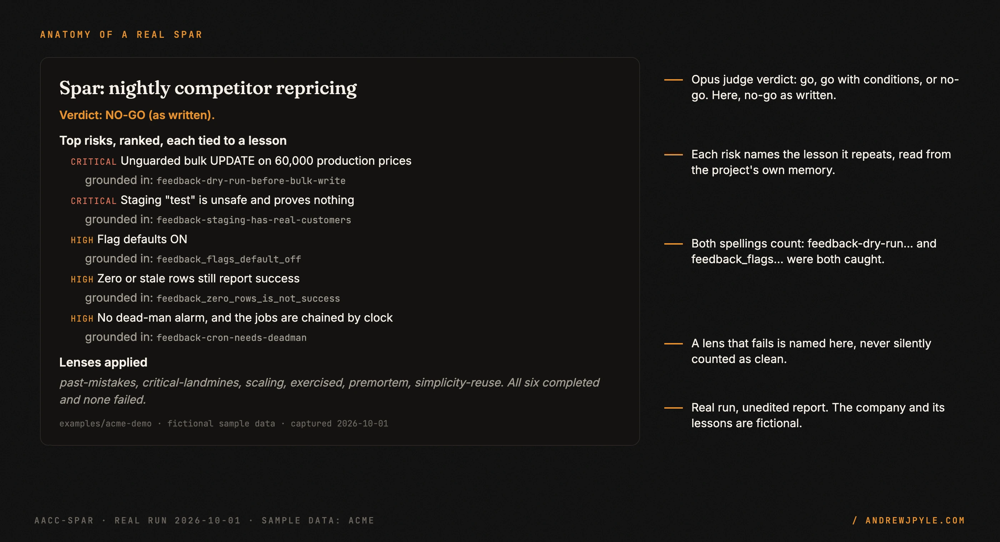
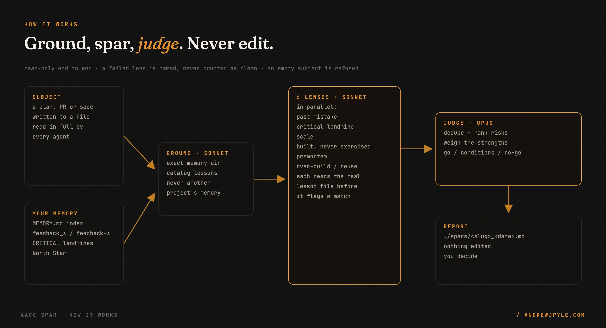
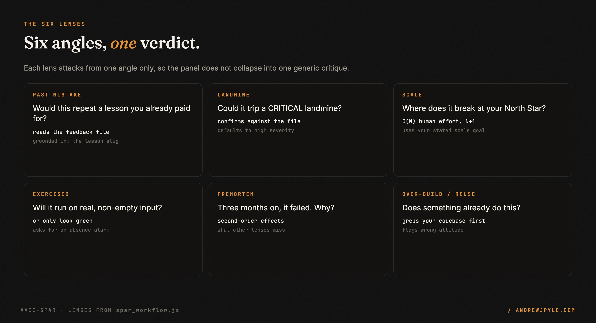

<p align="center">
  
</p>

<p align="center">
  <a href="https://github.com/andrewjpyle/aacc-spar/actions/workflows/ci.yml"></a>
  
  
</p>

# A red team for your plans, grounded in your own mistakes

`aacc-spar` is a Claude Code skill that attacks a plan, pull request or proposal **before** you
commit to it. Six adversarial "lens" agents each come at it from one angle, and an Opus judge returns
**go, go with conditions, or no-go** with a ranked list of risks.

- **It reads your history.** It checks the plan against the lessons in your Claude Code memory, so it
  catches you repeating a mistake you already paid for.
- **Six angles, no overlap.** Past mistakes, critical landmines, scale, built-but-never-exercised,
  premortem, and over-build.
- **Read-only.** It writes a report and a verdict. It never edits your plan or your code.

> **The one idea worth stealing, even if you never run this code:** the best critic is grounded in
> your own past mistakes, not a textbook. "Did you consider error handling?" is generic. "This writes
> to production in one UPDATE, and your notes say a bulk write without a dry run once set 40,000
> prices to $0" stops the mistake.

---

## What you get

A real run against [a fictional demo project](examples/acme-demo): five sample lessons in its
memory, and a plan to reprice 60,000 products every night that walks into all five.

<p align="center"></p>

The verdict was **no-go as written**, with conditions that turn it into a go. An excerpt from the
unedited report ([full report](examples/acme-demo/spars/nightly_competitor_repricing.md)):

> **1. CRITICAL: Unguarded bulk UPDATE on 60,000 production prices.**
> *Grounded in:* feedback-dry-run-before-bulk-write (2026-03, 40,000 SKUs set to $0).
> *Fix:* add a dry run with a row count and sample diff; abort above a ceiling; reject prices at or
> below zero or below cost plus margin; cap per-SKU change; snapshot prices for one-command
> rollback; apply in batches.

Every risk names the lesson it repeats, so the critique is about *this* team's history.

## Install

Copy this folder into your Claude Code skills directory:

```bash
git clone https://github.com/andrewjpyle/aacc-spar.git ~/.claude/skills/aacc-spar
```

`~/.claude/skills/aacc-spar/SKILL.md` and `spar_workflow.js` must both exist. A project-local
`.claude/skills/aacc-spar/` works too. Restart Claude Code (or open a new session) so it picks up
the skill.

**Requires** Claude Code with the `Workflow` tool, which runs the fan-out and the model tiering.

## Run it

From the root of the project you want the review grounded in:

```
/aacc-spar stress-test the plan in docs/plan.md
```

Or just ask: "poke holes in this plan", "red-team this PR", "what could go wrong with this?".
The skill writes the subject to a file, runs the panel, saves the report to
`./spars/<slug>_<date>.md`, and gives you the verdict.

## How it works

<p align="center"></p>

1. **Ground (Sonnet).** Finds your project's memory directory by its **exact** path,
   `~/.claude/projects/<your project path, non-alphanumerics as "-">/memory`, and reads `MEMORY.md`.
   It collects your lesson files (`feedback_*` and `feedback-*`), anything under a CRITICAL heading,
   and your North Star if you have one. It never borrows another project's memory.
2. **Spar (6 x Sonnet, in parallel).** Each lens attacks from one angle. The two memory lenses open
   the actual lesson file before they claim a match, so a risk is not raised from a one-line summary.
3. **Judge (Opus).** Dedupes and ranks the risks by severity, likelihood and blast radius, weighs
   what the plan gets right, and returns the verdict with conditions.

<p align="center"></p>

## Your memory, and what makes it work well

The review is only as sharp as your notes. It works best when your project's `MEMORY.md` indexes
one lesson per file, with the incident in the one-line description:

```markdown
## CRITICAL: re-read before acting
- [Never run a bulk write without a dry run first](feedback-dry-run-before-bulk-write.md): the 2026-03 price wipe changed 40,000 SKUs to $0.

## Lessons
- [A job that reports success over zero rows is a silent failure](feedback_zero_rows_is_not_success.md): the sync "passed" for 9 days on an empty table.
```

With no memory at all, the panel still runs and reasons from general principles.

## Failure handling

| What goes wrong | What the skill does |
|---|---|
| No subject given | refuses to run, instead of returning a confident verdict over nothing |
| The ground agent fails | continues with an empty catalog and says so |
| A lens agent fails | leaves it out and names it; a missing angle is never counted as clean |
| Every lens fails | refuses to produce a verdict |
| The judge returns nothing | raises an error instead of an empty result |

Each row has a test in `test/workflow.test.mjs`, which runs the real workflow script with stubbed
agents.

## The patterns

| Pattern | The failure it prevents |
|---|---|
| Ground in the user's own lessons | generic advice that misses the mistake this team actually makes |
| One angle per lens | six reviewers writing the same critique |
| Read the lesson file before claiming a match | a risk invented from a one-line summary |
| Exact memory path, never a fuzzy match | a review grounded in the wrong project's history |
| Refuse an empty subject | a confident verdict about nothing |
| Propose, never edit | a reviewer that "fixes" your plan without asking |

## FAQ

**Does it change my code or my plan?** No. It reads, then writes one report file under `./spars/`.

**What does a run cost?** Eight agents: one Sonnet ground, six Sonnet lenses, one Opus judge. A
panel, not a swarm.

**Is a no-go a veto?** No. It is advice. Shipping deliberate work is fine; the point is that you
shipped it knowing the risks.

**Why "aacc"?** It was extracted from the author's agent operations platform (AACC). The skill
itself has no dependency on it.

## Development

```bash
npm test     # 12 tests: the real workflow script with stubbed agents
```

## License

MIT. By [Andrew Pyle](https://andrewjpyle.com).
